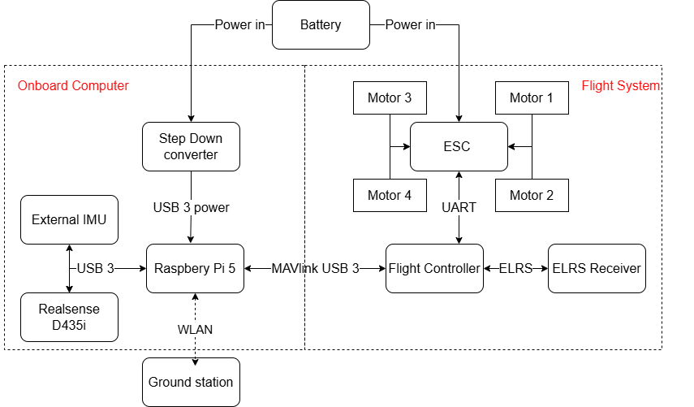
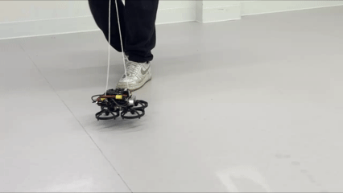

# Autonomous Drone V3 — Team KW-076

An autonomous indoor mapping quadrotor built for ICON Labs. The drone navigates and generates a 3D occupancy map without human input, using VINS-Fusion for visual-inertial odometry and FUEL for exploration planning. All software runs in Docker containers for reproducibility.

---

## Table of Contents
1. [Overview](#overview)
2. [Hardware](#hardware)
3. [Prerequisites](#prerequisites)
4. [Setup — Raspberry Pi (Drone)](#setup--raspberry-pi-drone)
5. [Setup — Ground Station (Linux PC)](#setup--ground-station-linux-pc)
6. [Launching the System](#launching-the-system)
7. [Networking Options](#networking-options)
8. [Parameter Modification](#parameter-modification)
9. [Building Images from Source](#building-images-from-source)
10. [Reference Files](#reference-files)

---

## Overview


*Drone V3 — autonomous indoor mapping quadrotor (241 mm span, 138 mm height)*

```
┌──────────────────────────────────────────┐   WiFi / Tailscale    ┌──────────────────────────────┐
│         Raspberry Pi 5 (Onboard)         │◄─────────────────────►│   Ground Station PC (x86)    │
│                                          │                        │                              │
│  Docker: fastdrone_image_pi              │                        │  Docker: fastdrone_gs        │
│  ├─ roscore  ← ROS Master lives here     │                        │  ├─ VINS-Fusion (odometry)   │
│  ├─ realsense_ros  (D435i, 30 Hz)        │                        │  ├─ FUEL exploration planner │
│  ├─ wheeltec_n100_ros  (IMU, 200 Hz)     │                        │  └─ Rviz visualisation       │
│  ├─ MAVROS  (ROS ↔ MAVLink bridge)       │                        │                              │
│  └─ PX4 controller (Kakute H7 Mini)      │                        │                              │
└──────────────────────────────────────────┘                        └──────────────────────────────┘
```

The ROS Master runs **onboard** the Pi 5, eliminating the WiFi round-trip latency that made the previous generation unstable. VINS-Fusion and FUEL run on the ground station PC and connect to the Pi's ROS network over the same WiFi link, subscribing to sensor topics and publishing trajectory setpoints back to MAVROS.

- **Odometry:** VINS-Fusion — stereo infrared + IMU visual-inertial fusion
- **Exploration:** FUEL (Fast UAV Exploration) — hierarchical 3D frontier planning
- **Operating environment:** 10 m × 10 m × 3 m indoor space

---

## Hardware

| Component | Model | Key Spec |
|-----------|-------|----------|
| Onboard Computer | Raspberry Pi 5 | 16 GB RAM |
| Flight Controller | Holybro Kakute H7 Mini | PX4 firmware, 1 kHz attitude loop |
| Stereo Depth Camera | Intel RealSense D435i | 0.2–10 m range, USB 3.0 |
| IMU | WHEELTEC N100 | 200 Hz, 0.1° RMS, USB-C |
| Motor Controller (ESC) | HAKRC BLHeli_32 45A | DShot600 protocol |
| Motors (×4) | VCI Spark 1404 3750KV | 3.5-inch propellers |
| Battery | Melasta 4S 14.8V 2200mAh 50C | ≥5 min flight time |
| BMS / Power Module | CRIUS 28V 90A | 5V regulated output for Pi 5 |
| RC Receiver | ELRS Receiver | Connected to Kakute H7 Mini |
| Frame | Custom (carbon fiber + PLA+ arms) | 241 mm span, 138 mm height |

**Frame layout:**
- *Lower half:* 4 propeller guards with integrated landing legs; ESC mounted under central plate
- *Upper half:* Pi 5 in protective cage, Kakute H7 Mini, N100 IMU, and D435i — all mounted close to centre to minimise vibration coupling


*Full wiring diagram showing power and signal connections between all onboard components*


*Drone V3 in stable hover — demonstrating the closed-loop flight control achieved with the Pi 5 onboard ROS Master architecture*

---

## Prerequisites

### Ground Station PC (Linux)

Install Docker Engine following the official guide for your distro:
https://docs.docker.com/engine/install/

### Raspberry Pi 5 (Drone)

No manual install needed — just pull the pre-built Docker image as described below. Any Linux OS works as long as Docker is installed.

---

## Setup — Raspberry Pi (Drone)

**1. Pull the pre-built image**

```bash
docker pull ghcr.io/aaranp/autonomous-drone-upgrade/fastdrone_image_pi:latest-arm64
```

**2. Clone the repo onto the Pi**

```bash
git clone https://github.com/AaranP/Autonomous-drone-upgrade.git
cd Autonomous-drone-upgrade
```

**3. Start the drone container**

```bash
./run_container.sh
```

The script will:
- Detect network interfaces (`eth0` / `wlan0`) and show the Pi's IP address
- Ask whether to connect via **Direct IP** or **Tailscale VPN**
- Start the container and launch `roscore` (ROS Master) via `shfiles/server.sh`

> Note the IP address printed — you will need it for the ground station step.

---

## Setup — Ground Station (Linux PC)

**1. Pull the pre-built image**

```bash
docker pull ghcr.io/aaranp/autonomous-drone-upgrade/fastdrone_groundstation:latest
```

> Alternatively, build locally (~10 min):
> ```bash
> ./build_groundstation_image.sh
> ```

**2. Start the ground station container**

```bash
./run_linux_groundstation.sh
```

The script will:
- Enable X11 forwarding so GUI apps (Rviz) render on your desktop
- Ask whether to connect via **Direct IP** or **Tailscale VPN**
- Prompt for the Pi's ROS Master IP (noted above)
- Launch the container and connect to the Pi's ROS Master via `shfiles/client_linux.sh`

---

## Launching the System

### Step 1 — Drone side

Open a new terminal, attach to the running drone container, and start all sensors:

```bash
./attach_server.sh
# inside the container:
/root/shfiles/rspx4.sh
```

This starts in order:
1. **RealSense D435i** — `realsense2_camera` (RGB, depth, point cloud at 30 Hz)
2. **WHEELTEC N100 IMU** — `wheeltec_n100_ros` (200 Hz)
3. **MAVROS** — ROS ↔ MAVLink bridge to Kakute H7 Mini over UART
4. **PX4 controller** — `px4ctrl` (receives trajectory setpoints, sends motor commands at 1 kHz)

> **IMU initialisation:** Place the drone flat and stationary for ~60 seconds after launch to allow the N100 bias calibration to complete before arming.

### Step 2 — Ground station side

Open a new terminal, attach to the ground station container, and start odometry + planning:

```bash
./attach_groundstation.sh
# inside the container:
/root/shfiles/launch_client.sh
```

This starts in order:
1. RealSense image topic decompression
2. **VINS-Fusion** — visual-inertial odometry (outputs `/vins_fusion/odometry` at 30 Hz, `/vins_fusion/imu_propagate` at 200 Hz)
3. Depth topic decompression
4. **FUEL exploration manager** (`exploration.launch`) — 3D frontier planning, ~10 Hz
5. **Rviz** — live 3D map and trajectory visualisation

---

## Networking Options

| Mode | How to use |
|------|-----------|
| **Direct IP** | Both devices on the same LAN. Enter the Pi's IP when prompted. |
| **Tailscale VPN** | Install Tailscale on both devices. The Pi should have hostname `ledrone` — it is resolved automatically. |

---

## Parameter Modification

### VINS-Fusion (odometry tuning)

File: [`src/realflight_modules/VINS-Fusion/config/fast_drone_250.yaml`](src/realflight_modules/VINS-Fusion/config/fast_drone_250.yaml)

| Parameter | Description |
|-----------|-------------|
| `imu_topic` / `image0_topic` / `image1_topic` | Sensor topic names |
| `body_T_cam0` / `body_T_cam1` | Camera-to-IMU extrinsic transforms (4×4 matrix) |
| `max_cnt` | Maximum tracked features (default 220) |
| `acc_n`, `gyr_n`, `acc_w`, `gyr_w` | IMU noise parameters for N100 |
| `estimate_td` | Enable camera-IMU time offset estimation |

### Exploration Planner (FUEL)

File: [`src/fuel_planner/exploration_manager/launch/exploration.launch`](src/fuel_planner/exploration_manager/launch/exploration.launch)

| Parameter | Description |
|-----------|-------------|
| `map_size_x/y/z` | Map dimensions in metres (default 10×10×3 m) |
| `box_min/max_x/y/z` | Exploration bounding box |
| `max_vel`, `max_acc` | Velocity (default 0.4 m/s) and acceleration limits |
| `fx`, `fy`, `cx`, `cy` | RealSense D435i depth camera intrinsics |

---

## Building Images from Source

### Drone image (ARM64, for Raspberry Pi 5)

```bash
# Requires Docker buildx with ARM64 emulation
docker run --privileged --rm tonistiigi/binfmt --install all
docker buildx build --platform linux/arm64 -t fastdrone_image_pi:latest-arm64 .
```

> Expected build time: 1–2 hours. The Dockerfile builds ROS Noetic from source (no official ARM64 binary exists), installs librealsense 2.50.0, and compiles the full catkin workspace.

### Ground station image (x86)

```bash
./build_groundstation_image.sh
```

---

## Reference Files

| Folder / File | Contents |
|---------------|----------|
| [`pictures/`](pictures/) | Drone photos and wiring diagram |
| [`CAD/`](CAD/) | SolidWorks part files — `Pi_holder.SLDPRT`, `Prop_guard.SLDPRT` |
| [`purchase_list.xlsx`](purchase_list.xlsx) | Bill of materials |
| [`readme_en.pdf`](readme_en.pdf) | Original Fast-Drone assembly and tuning guide (upstream reference) |
